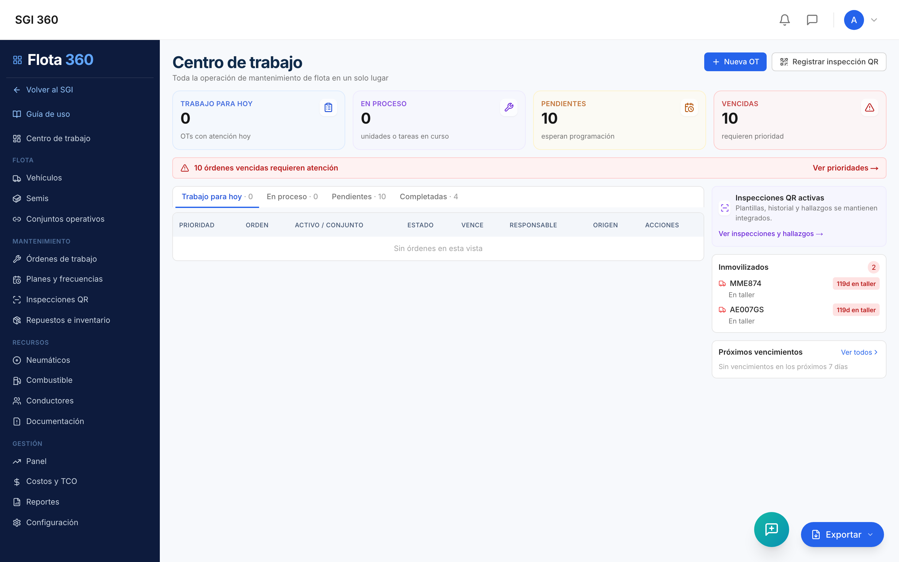
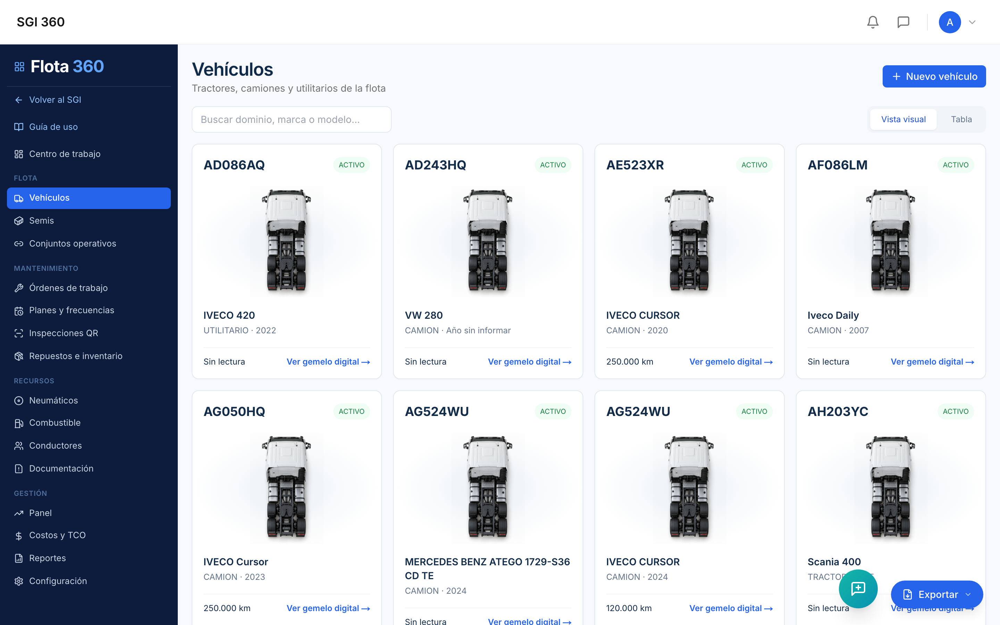
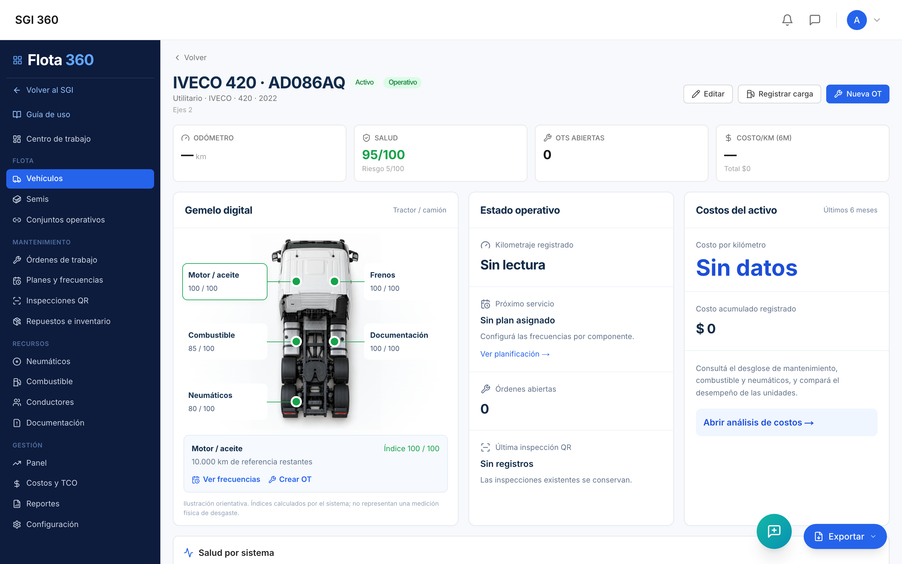
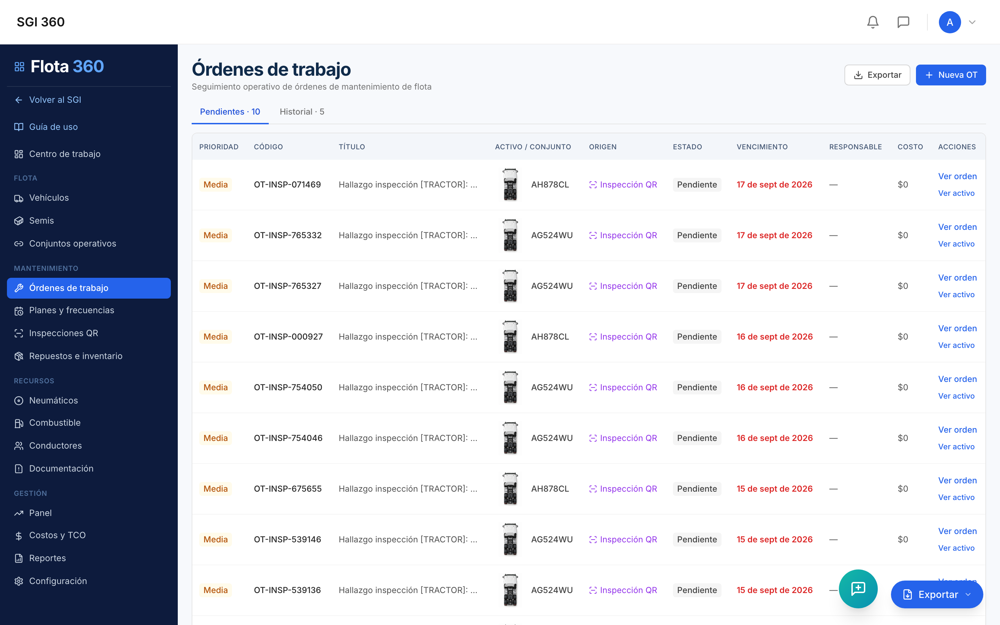
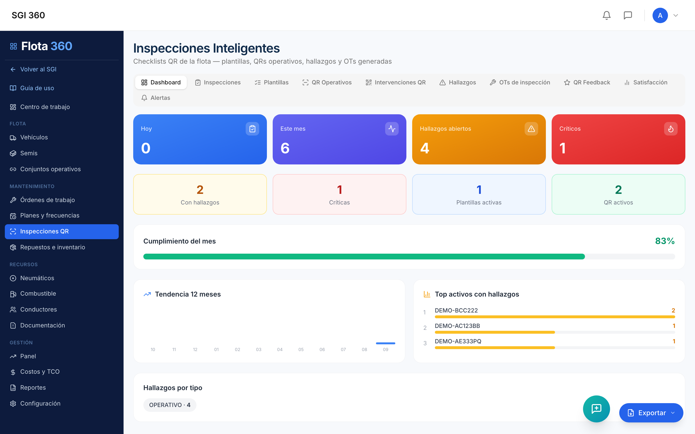
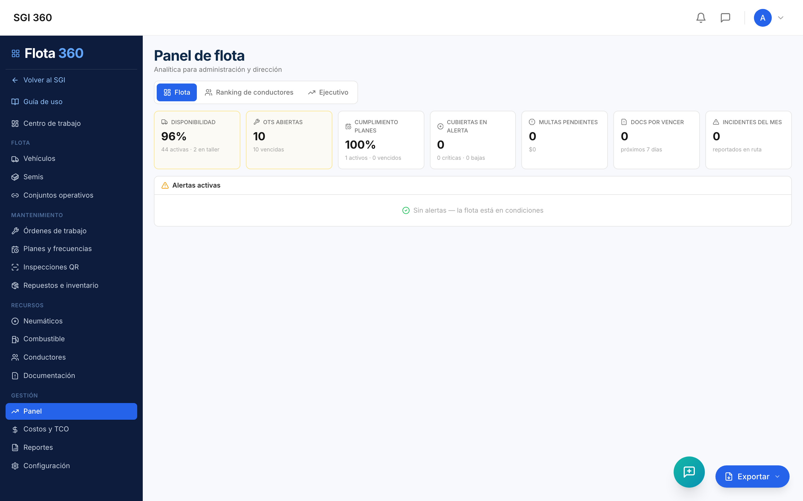

\newpage

# 1. Portada y Control de Versiones

\begin{center}
\vspace*{2cm}
{\Large \textbf{[LOGO INSTITUCIONAL DADA]}}\\[0.5cm]
{\small Insertar archivo corporativo: \texttt{logo-dada.png}}\\[3cm]
{\Huge \textbf{Instructivo Integral y\\Manual Operativo}}\\[0.8cm]
{\LARGE Módulo \textbf{Flota 360}}\\[0.4cm]
{\Large Plataforma SGI360}\\[3cm]
\end{center}

| **Campo** | **Detalle** |
|---|---|
| Título oficial | Instructivo Integral y Manual Operativo: Módulo Flota 360 — SGI360 |
| Autor | Dirección de Tecnología — SGI360 |
| Versión | 1.1 |
| Fecha de emisión | Septiembre 2026 |
| Dirigido a | Dirección / C-Level |
| Clasificación | Uso interno — Documento ejecutivo |
| Ambiente documentado | Producción — https://logismart.ar |

## Control de versiones

| Versión | Fecha | Autor | Descripción del cambio |
|---|---|---|---|
| 1.0 | Sep 2026 | Dirección de Tecnología | Emisión inicial del instructivo integral del módulo Flota 360 |
| 1.1 | Sep 2026 | Dirección de Tecnología | QR personal del mecánico (agenda de tareas y evidencia de cierre) y ranking de desempeño del taller |

\newpage

# 2. Resumen Ejecutivo y Propuesta de Valor para la Dirección

## 2.1 Visión general

**Flota 360** es el módulo de gestión integral de flota de transporte dentro del ecosistema **SGI360**. Centraliza en una única plataforma el ciclo de vida completo de cada unidad: registro, inspección diaria mediante códigos QR, mantenimiento preventivo y correctivo, gestión de neumáticos y combustible, documentación y vencimientos, y analítica ejecutiva de costos (TCO).

El módulo opera bajo un principio de **cadena operativa cerrada**: una inspección QR realizada por el conductor desde su celular genera hallazgos; los hallazgos generan órdenes de trabajo automáticamente; las órdenes de trabajo actualizan la salud del vehículo (gemelo digital), los costos y los indicadores del panel gerencial. Ningún evento queda fuera del sistema.

## 2.2 Objetivos estratégicos

- **Reducción de costos operativos**: control del costo por kilómetro (CPK), costo total de propiedad (TCO) por unidad, detección de desvíos de consumo de combustible y anomalías de carga.
- **Optimización de tiempos**: cola de trabajo diaria priorizada para el taller, medición de estadías en turnos de 9 horas y alertas de estadía prolongada.
- **Mitigación de riesgos**: inspecciones pre-operacionales obligatorias, control de vencimientos documentales (VTV, seguros, habilitaciones), controles pre-servicio de conductores (alcoholemia, fatiga) y trazabilidad completa de cada intervención.
- **Maximización de disponibilidad**: tablero de disponibilidad de flota en tiempo real con estados operativos (Operativo / En taller / En reparación).

## 2.3 Impacto en la toma de decisiones gerenciales

| Decisión gerencial | Instrumento en Flota 360 |
|---|---|
| ¿Renovar o conservar una unidad? | Análisis de reemplazo con proyección de costo a 12 meses vs. costo de unidad nueva |
| ¿Dónde se pierde dinero? | TCO por unidad, desglose combustible/mantenimiento/neumáticos, desvíos por unidad |
| ¿La flota está disponible? | Tablero de disponibilidad: % operativo, turnos en taller, alertas de estadía |
| ¿Los conductores operan seguro? | Ranking de conductores por desempeño, multas, incidentes y rendimiento |
| ¿Se cumple el mantenimiento? | Cumplimiento de planes preventivos, alertas de servicio, programa semanal |
| ¿Cómo rinde el taller? | Ranking de mecánicos: cumplimiento, puntualidad, tiempos de resolución y costos por técnico |

\newpage

# 3. Arquitectura de Navegación y Estructura del Menú "Flota 360"

## 3.1 Acceso al módulo

El módulo se accede desde el menú principal de SGI360. Al ingresar, se despliega una **barra lateral propia** (fondo azul institucional `#0d1b3d`) que reemplaza la navegación general, con dos accesos permanentes en la parte superior:

- **Volver al SGI** — regresa al dashboard general de SGI360.
- **Guía de uso** — abre el Centro de Ayuda (`/modo-de-uso?guide=flota-360`) con la guía interactiva del módulo.

En dispositivos móviles, la navegación se presenta como un botón flotante "Flota 360" que despliega el menú en formato drawer.

## 3.2 Estructura jerárquica completa del menú

El menú se organiza en **5 grupos funcionales y 17 opciones**:

```
FLOTA 360
├── Centro de trabajo                    (/flota-360)
│
├── FLOTA
│   ├── Vehículos                        (/flota-360/vehiculos)
│   ├── Semis                            (/flota-360/semis)
│   └── Conjuntos operativos             (/flota-360/conjuntos)
│
├── MANTENIMIENTO
│   ├── Órdenes de trabajo               (/flota-360/ordenes)
│   ├── Mecánicos                        (/flota-360/mecanicos)
│   ├── Planes y frecuencias             (/flota-360/planes)
│   ├── Inspecciones QR                  (/flota-360/inspecciones)
│   └── Repuestos e inventario           (/flota-360/repuestos)
│
├── RECURSOS
│   ├── Neumáticos                       (/flota-360/neumaticos)
│   ├── Combustible                      (/flota-360/combustible)
│   ├── Conductores                      (/flota-360/conductores)
│   └── Documentación                    (/flota-360/documentacion)
│
└── GESTIÓN
    ├── Panel                            (/flota-360/panel)
    ├── Disponibilidad                   (/flota-360/disponibilidad)
    ├── Costos y TCO                     (/flota-360/costos)
    ├── Reportes                         (/flota-360/reportes)
    └── Configuración                    (/flota-360/configuracion)
```

## 3.3 Permisos, roles y accesos

| Perfil | Acceso típico | Alcance |
|---|---|---|
| **Dirección / Gerencia** | Panel, Disponibilidad, Costos y TCO, Reportes | Lectura ejecutiva de KPIs, costos y proyecciones |
| **Jefe de taller / Mantenimiento** | Centro de trabajo, Órdenes, Planes, Inspecciones QR, Repuestos, Mecánicos | Gestión operativa completa del mantenimiento |
| **Administrativo de flota** | Vehículos, Semis, Conjuntos, Conductores, Documentación, Combustible | Altas, registros y vencimientos |
| **Conductor / fletero** | Vista pública de inspección (`/inspeccionar/[token]`) | Sin login: completa el checklist escaneando el QR de la unidad |
| **Mecánico** | Vista pública de intervención (`/mantenimiento-qr/[token]`) | Sin login: registra intervención escaneando el QR del vehículo |
| **Mecánico (QR personal)** | Vista pública de tareas (`/mecanico-qr/[token]`) | Sin login: ve sus OTs asignadas, las inicia y evidencia el cierre escaneando su QR personal |

> **Nota de seguridad**: las vistas públicas por QR no requieren autenticación pero están vinculadas a un token único por activo; solo exponen el formulario de la plantilla asignada, sin acceso a datos internos.

\newpage

# 4. Detalle Exhaustivo de Funcionalidades por Módulo y Pantalla

## 4.1 Centro de trabajo

| Campo | Detalle |
|---|---|
| **Ruta** | `/flota-360` |
| **Propósito** | Cola de trabajo diaria del taller: la pantalla de apertura del módulo |
| **Fuente de datos** | `GET /fleet-ops/centro-de-trabajo` |



### Funcionalidad

- **Tarjetas KPI superiores**: *Trabajo para hoy* (OTs con atención hoy), *En proceso* (unidades o tareas en curso), *Pendientes* (esperan programación), *Vencidas* (con indicador de prioridad crítica en rojo, o verde si no hay).
- **Pestañas de la cola**: `Trabajo para hoy` · `En proceso` · `Pendientes` · `Completadas`, cada una con su contador.
- **Acceso directo "Ver prioridades"**: salta a la pestaña de pendientes cuando hay OTs vencidas.
- Cada OT muestra su **origen**: Inspección QR, Plan de mantenimiento o Correctivo.

### Caso de uso

El jefe de taller abre el módulo cada mañana: la pestaña *Trabajo para hoy* es su agenda; las *Vencidas* en rojo son la prioridad inmediata.

---

## 4.2 Vehículos

| Campo | Detalle |
|---|---|
| **Ruta** | `/flota-360/vehiculos` |
| **Propósito** | Registro y fichas de tractores, camiones y utilitarios |
| **Fuente de datos** | `GET/POST /flota/vehiculos` |



### Funcionalidad

- **Buscador**: filtra por dominio, marca o modelo.
- **Dos vistas**: *Vista visual* (tarjetas con ilustración del tipo de unidad, dominio, estado, marca/modelo, odómetro y acceso al gemelo digital) y *Tabla*.
- **Botón "Nuevo vehículo"**: formulario con campos:
  - **Dominio / Identificación** *(obligatorio)* — patente de la unidad.
  - **Tipo** — selector: camión, tractor, utilitario (en Semis se fija como SEMI).
  - **Marca**, **Modelo**, **Año**.
  - **Odómetro actual (km)** — base de los planes por kilometraje y las proyecciones.
  - **Valor de adquisición** — insumo del análisis de reemplazo y TCO.
- **Alta automática de activo**: cada vehículo creado genera su activo de mantenimiento vinculado (`maintenanceAssetId`), habilitando OTs, planes y QR propios.
- **Estados de la unidad**: badge de estado operativo en cada tarjeta.

### Caso de uso

Al incorporar un camión nuevo, el administrativo lo da de alta con dominio y odómetro inicial; desde ese momento la unidad puede recibir planes, inspecciones QR y OTs.

---

## 4.3 Ficha del vehículo — Gemelo digital

| Campo | Detalle |
|---|---|
| **Ruta** | `/flota-360/vehiculos/[id]` |
| **Propósito** | Vista 360° de la unidad: salud, riesgo, estado operativo, costos y proyección |
| **Fuentes** | `/flota/vehiculos/:id/completo`, `/flota/vehiculos/:id/twin`, `/fleet-ops/vehiculos/:id/estado-historial`, `/flota/vehiculos/:id/proyeccion` |



### Funcionalidad

- **Gemelo visual (DigitalTwin)**: representación gráfica de la unidad con el estado de cada componente coloreado según su salud.
- **KPIs de cabecera**: *Salud /100* (calculada de OTs, inspecciones y km), *Riesgo /100*, *OTs abiertas*.
- **Estado operativo**: botones para cambiar entre `OPERATIVO`, `EN_TALLER`, `EN_REPARACION`. Cada cambio genera un evento en el historial de estadíos (base del tablero de disponibilidad). Enlace *"Ver historial (N eventos)"* con la trazabilidad completa.
- **Próximo servicio**: plan asignado, km restantes o fecha objetivo, con link directo a la planificación.
- **Costos del activo**: últimos 6 meses.
- **Análisis de reemplazo**: proyección de costo a 12 meses vs. costo anual de una unidad nueva, con recomendación (REEMPLAZAR / EVALUAR / VIGILAR según umbrales configurables).
- **Salud por sistema**: barra de salud porcentual por componente (motor, frenos, etc.).
- **Proyección — "¿qué pasa si recorro…?"**: se ingresa un kilometraje futuro (ej. +20.000 km) y el sistema estima qué servicios y componentes requerirán atención, con salud actual → proyectada por componente y costos estimados.
- **Alertas activas** por componente.
- **OTs recientes** e **Historial de mantenimiento** completos.
- **Editar vehículo**: actualización de datos de la unidad incluyendo estado.

### Caso de uso

Antes de aprobar la renovación de un tractor, Dirección abre su ficha: salud 62/100, proyección de reparaciones a 12 meses superior al 70% del costo de una unidad nueva → recomendación REEMPLAZAR. Decisión respaldada por datos.

---

## 4.4 Semis

| Campo | Detalle |
|---|---|
| **Ruta** | `/flota-360/semis` |
| **Propósito** | Registro de semirremolques como activos independientes |

Misma interfaz que Vehículos (componente compartido `VehiculosList` en modo `semis`): los semirremolques se gestionan como activos independientes **con mantenimiento y QR propios**. El alta fija el tipo `SEMI` automáticamente.

### Caso de uso

Un semi con problema de suspensión recibe su propia inspección QR y OT, independientemente del tractor al que esté acoplado.

---

## 4.5 Conjuntos operativos

| Campo | Detalle |
|---|---|
| **Ruta** | `/flota-360/conjuntos` |
| **Propósito** | Acople tractor + semi como unidad operativa consolidada |
| **Fuentes** | `GET/POST /fleet-ops/conjuntos`, `POST /fleet-ops/conjuntos/:id/desacoplar` |

### Funcionalidad

- **Botón "Nuevo conjunto"**: modal *"Acoplar tractor + semi"* con selectores de ambas unidades.
- **Listado de conjuntos activos** con sus unidades componentes.
- **Botón "Desacoplar"**: disuelve el conjunto cuando cambia la configuración de viaje.
- **Consolidación**: el conjunto agrupa costos y OTs de ambas unidades (`GET /fleet-ops/conjuntos/:id/costos`).

### Caso de uso

El tractor ABC123 viaja acoplado al semi XYZ789 durante un mes: el conjunto consolida el costo real del viaje completo. Al cambiar de semi, se desacopla y se arma el nuevo conjunto.

---

## 4.6 Órdenes de trabajo

| Campo | Detalle |
|---|---|
| **Ruta** | `/flota-360/ordenes` |
| **Propósito** | Gestión de OTs de la flota: preventivas, correctivas y generadas por inspección |
| **Fuentes** | `/maintenance/work-orders?scope=fleet`, `/flota/vehiculos`, `/maintenance/technicians?scope=fleet` |



### Funcionalidad

- **Pestañas por estado** de las OTs con contadores.
- **Badge de origen** por OT: *Inspección QR* (violeta), *Plan de mantenimiento* (azul), *Preventivo*, *Correctivo*.
- **Botón "Exportar"**: descarga CSV de las órdenes.
- **Botón "Nueva orden de trabajo"**: formulario con vehículo, tipo, prioridad, fecha programada, mecánico asignado y descripción.
- **"Ver orden"**: detalle con cambio de estado (Pendiente → En proceso → Completada), carga de repuestos utilizados desde el catálogo (`/maintenance/work-orders/:id/parts`), costo de la intervención y registro de factura asociada (`/flota/facturas`).
- **Cambio de estado operativo del vehículo** desde la OT (`/fleet-ops/vehiculos/:id/estado`): al completarse, la unidad vuelve a OPERATIVO.

### Caso de uso

Una inspección QR detecta "freno de mano inoperativo" → se genera la OT automáticamente → el jefe asigna mecánico y prioridad CRITICAL → el mecánico completa la OT cargando repuestos y costo → la unidad vuelve a operativo y su salud se recalcula.

---

## 4.7 Mecánicos

| Campo | Detalle |
|---|---|
| **Ruta** | `/flota-360/mecanicos` |
| **Propósito** | CRUD del equipo de mecánicos de flota |
| **Fuente** | `/maintenance/technicians?scope=fleet` (scope `FLEET`) |

### Funcionalidad

- **Dos vistas**: pestaña *Listado* (gestión del personal) y pestaña *Ranking* (desempeño del equipo).
- **Listado** de mecánicos con especialización.
- **"Nuevo mecánico" / "Editar"**: nombre, especialización (ej. motor, frenos, electricidad) y datos de contacto.
- **Eliminar** con confirmación.
- **QR personal del mecánico**: botón QR en cada fila que genera (o reactiva) el código único del mecánico; el modal permite **copiar el enlace** e **imprimir el cartel** para entregar al mecánico (ver sección 6.5).
- **Segregación por scope**: los mecánicos de flota (`FLEET`) son independientes de los técnicos de Infraestructura (`INFRA`); cada módulo ve solo los suyos.

### Ranking de mecánicos (pestaña Ranking)

Tablero de desempeño del equipo de taller (`GET /maintenance/technicians/ranking`), con selector de período (7 / 30 / 90 días) y tarjetas ordenadas por score:

- **Score compuesto**: 60% cumplimiento + 40% puntualidad, con medallas para el top 3.
- **Cumplimiento**: % de OTs completadas sobre el total cerrable del período.
- **Puntualidad**: % de OTs completadas antes del fin del día programado.
- **Contadores**: completadas, en curso, pendientes y vencidas (OTs abiertas con fecha programada superada).
- **Tiempos promedio**: resolución (creación → cierre) y ejecución (inicio → cierre) en horas.
- **Costos**: total y de repuestos de las OTs completadas en el período.

### Caso de uso

El jefe de taller imprime el QR personal de cada mecánico y se lo entrega. Cada mañana el mecánico escanea su QR, ve sus tareas del día y evidencia cada cierre con notas, odómetro y repuestos. A fin de mes, Dirección revisa el Ranking para evaluar cumplimiento y puntualidad del equipo.

---

## 4.8 Planes y frecuencias

| Campo | Detalle |
|---|---|
| **Ruta** | `/flota-360/planes` |
| **Propósito** | Motor de mantenimiento preventivo: reglas por componente, programa semanal, alertas y carga de taller |
| **Fuentes** | `/fleet-ops/component-rules`, `/fleet-ops/alertas-servicio`, `/fleet-ops/programa-mantenimiento`, `/fleet-ops/repuestos-inventario`, `/fleet-ops/carga-taller`, `/fleet-ops/planes-activos`, `/fleet-ops/filtros` |

### Funcionalidad

- **Reglas por componente** (`component-rules`): definen frecuencia de mantenimiento por componente (ej. aceite de motor cada 30.000 km o 365 días), con acción al vencimiento (ALERTA / SUGERENCIA_OT / GENERAR_OT), km de anticipación y aplicación a activos puntuales con excepciones de frecuencia por unidad.
- **Nuevo plan**: formulario con título, vehículo/activo, unidad de frecuencia (días o km), valor de frecuencia, km de disparo y próxima fecha de ejecución.
- **Programa de mantenimiento**: grilla semanal (columnas = días, filas = unidades) con las OTs programadas; permite **mover OTs de fecha** (`PATCH /programa-mantenimiento/mover-ot`).
- **Alertas de servicio**: planes próximos a vencer o vencidos, filtrables.
- **Carga de taller**: vista de ocupación de los próximos 7 días.
- **Planes activos**: estado de cumplimiento por unidad.
- **Repuestos del inventario** vinculados a las reglas.

### Caso de uso

Se configura la regla "Aceite y filtros — cada 15.000 km" aplicada a todos los tractores. El sistema monitorea el odómetro de cada unidad y genera la OT preventiva automáticamente al aproximarse el vencimiento.

---

## 4.9 Inspecciones QR (Inspecciones Inteligentes)

| Campo | Detalle |
|---|---|
| **Ruta** | `/flota-360/inspecciones` |
| **Propósito** | Núcleo del sistema de inspección: plantillas, QRs operativos, hallazgos y OTs |
| **Fuente** | API `/inspecciones/*` |



### Estructura de pestañas (10)

| Pestaña | Función |
|---|---|
| **Dashboard** | KPIs: inspecciones hoy/mes, con hallazgos, críticas, hallazgos abiertos/críticos, plantillas y QRs activos, % cumplimiento, tendencia 12 meses, hallazgos por tipo, top 5 activos con más hallazgos |
| **Inspecciones** | Lista de inspecciones realizadas con su resultado |
| **Plantillas** | CRUD de checklists + importación de templates built-in |
| **QR Operativos** | Generación de QRs vinculados a unidades de flota + impresión de cartel |
| **Intervenciones QR** | QR para que el mecánico registre intervenciones desde el taller |
| **Hallazgos** | Gestión de desvíos detectados: filtro por estado/severidad, creación de OT |
| **OTs de inspección** | Órdenes generadas desde hallazgos |
| **QR Feedback** | QRs de satisfacción/feedback vinculados a unidades |
| **Satisfacción** | Estadísticas del feedback recibido |
| **Alertas** | Configuración de notificaciones de inspección |

> El detalle completo del flujo QR y los checklists se desarrolla en la **Sección 6**.

---

## 4.10 Repuestos e inventario

| Campo | Detalle |
|---|---|
| **Ruta** | `/flota-360/repuestos` |
| **Propósito** | Stock de repuestos del taller de flota |
| **Fuente** | `/maintenance/spare-parts` |

### Funcionalidad

- **Buscador** de repuestos.
- **"Nuevo repuesto"**: código (auto-generado si se deja vacío), descripción, stock inicial, costo.
- **Ajuste de stock** por repuesto (entrada/salida manual).
- **Movimientos**: historial de consumos por OT (`/fleet-ops/repuestos-inventario/:id/movimientos`).
- Los repuestos consumidos en una OT descuentan stock y alimentan el costo de mantenimiento del TCO.

---

## 4.11 Neumáticos

| Campo | Detalle |
|---|---|
| **Ruta** | `/flota-360/neumaticos` |
| **Propósito** | Gestión de cubiertas: posiciones, rotaciones, recaps, mediciones y costo/km |
| **Fuente** | `/flota/neumaticos` |

### Funcionalidad

- **"Nuevo neumático"**: código (ej. NEU-001), marca, medida (ej. 295/80R22.5), precio de compra.
- **Tabla de cubiertas** con estado.
- **Historial por cubierta**: rotaciones y posiciones/montajes por unidad (eje/lado/posición).
- **Mediciones de profundidad de banda** (`profBanda` + `kmAlMedir`): alimentan el modelo predictivo de desgaste (ver Reportes).
- Estados: EN_USO, desmontada, recaps con costo.

### Caso de uso

Con dos o más mediciones de profundidad por cubierta, el sistema calcula el desgaste en mm/1000 km y proyecta la fecha de reemplazo — anticipando compras y evitando cubiertas vencidas en ruta.

---

## 4.12 Combustible

| Campo | Detalle |
|---|---|
| **Ruta** | `/flota-360/combustible` |
| **Propósito** | Registro de cargas y rendimiento de la flota |
| **Fuentes** | `/flota/combustible`, `/flota/dashboard`, `/flota/vehiculos` |

### Funcionalidad

- **Registro de cada carga**: vehículo, fecha, litros, costo total, odómetro, tipo de combustible, estación.
- **Rendimiento automático km/L** por unidad (calculado entre cargas consecutivas por odómetro).
- **Tabla de cargas** y resumen de rendimiento de flota.
- Alimenta: costo por km, detección de cargas anómalas y desvíos de consumo en Reportes.

---

## 4.13 Conductores

| Campo | Detalle |
|---|---|
| **Ruta** | `/flota-360/conductores` |
| **Propósito** | Registro de choferes, licencias y documentación |
| **Fuentes** | `/flota/conductores`, `/driver-hub/documentos/upload` |

### Funcionalidad

- **"Nuevo conductor" / "Editar"**: nombre, categoría de licencia (C, D1, E…), datos de contacto.
- **Carga de documentos** del chofer (upload de archivos).
- **Eliminar** con confirmación.
- Base del **ranking de conductores** del Panel (score por desempeño, multas, incidentes y rendimiento).

---

## 4.14 Documentación

| Campo | Detalle |
|---|---|
| **Ruta** | `/flota-360/documentacion` |
| **Propósito** | Vencimientos, documentación de choferes, incidentes, bitácora y jornadas |

### Estructura de pestañas (7)

| Pestaña | Función |
|---|---|
| **Vencimientos** | VTV, seguros, habilitaciones y sus fechas de vencimiento por unidad — "Nuevo vencimiento" |
| **Docs chofer** | Documentación de conductores por unidad |
| **Incidentes** | Registro de incidentes en ruta (tipo, gravedad) |
| **Bitácora** | Registro de viajes/eventos por vehículo |
| **Jornadas** | Jornadas de conducción |
| **Libro de jornada** | Libro oficial de jornada (`/fleet-ops/libro-jornada`) |
| **Controles pre-servicio** | Controles de aptitud del conductor: alcoholemia, nivel de fatiga, apto |

### Caso de uso

La alerta "Docs por vencer — próximos 7 días" del Panel se origina aquí: ninguna unidad circula con VTV o seguro vencido sin que el sistema lo advierta.

---

## 4.15 Panel

| Campo | Detalle |
|---|---|
| **Ruta** | `/flota-360/panel` |
| **Propósito** | Tablero gerencial de la flota |
| **Fuentes** | `/flota/panel`, `/flota/conductores/scorecard` |



### Pestaña Flota — KPIs

- **Disponibilidad** % (activas · en taller)
- **OTs abiertas** (con alerta de vencidas)
- **Cumplimiento de planes** % (activos · vencidos)
- **Cubiertas en alerta** (críticas · bajas)
- **Multas pendientes** (cantidad y monto)
- **Docs por vencer** (próximos 7 días)
- **Incidentes del mes**

### Pestaña Ranking de conductores

Scorecard por conductor: desempeño, multas, incidentes y rendimiento de combustible — con rendimiento de flota km/L de referencia.

### Pestaña Ejecutivo

Costo real del mes con desglose (combustible / mantenimiento / facturas / multas) y desvío contra presupuesto.

---

## 4.16 Disponibilidad

| Campo | Detalle |
|---|---|
| **Ruta** | `/flota-360/disponibilidad` |
| **Propósito** | Tablero de estadíos operativos y tiempos de taller en turnos de 9 hs |
| **Fuente** | `/fleet-ops/disponibilidad?dias=N` |

### Funcionalidad

- **Selector de período**: 7 / 30 / 90 / 180 días.
- **Botón "Exportar tiempos"**: Excel por unidad y período para dirección (`/fleet-ops/tiempos-taller/export`).
- **KPIs**: Unidades totales, Operativas (% disponible), En taller, En reparación.
- **Alertas de estadía prolongada**: unidades no operativas que exceden el umbral configurable (default 5 días), con días/horas/turnos de estadía.
- **Ranking de estadía**: top 15 unidades por horas no disponibles en el período.
- **Cumplimiento preventivo por unidad**: planes al día / vencidos con porcentaje.
- **Presupuesto vs. gasto real del mes**: combustible + mantenimiento + neumáticos contra presupuesto mensual configurado.

---

## 4.17 Costos y TCO

| Campo | Detalle |
|---|---|
| **Ruta** | `/flota-360/costos` |
| **Propósito** | Vista ejecutiva de costos: evolución, composición, desvíos y TCO por unidad |
| **Fuentes** | `/fleet-ops/costos-tco`, `/flota/tco/analisis` |

### Funcionalidad

- **KPIs**: costo total del mes, costo por km, variación vs. mes anterior, unidades con desvío >20%.
- **Evolución de costos**: serie de los últimos 6 meses (combustible + mantenimiento + neumáticos).
- **Composición del mes**: distribución por rubro.
- **Tabla de desvíos por unidad**: costo del mes vs. anterior, variación %, causa principal (Combustible / Mantenimiento / Neumáticos) y desglose.
- **TCO por unidad**: costo total de propiedad.

---

## 4.18 Reportes

| Campo | Detalle |
|---|---|
| **Ruta** | `/flota-360/reportes` |
| **Propósito** | Informes analíticos para dirección y auditoría |
| **Fuentes** | `/fleet-ops/predictivo`, `/fleet-ops/kpis` |

### Secciones del informe

- **Costo por km (CPK)** por unidad.
- **Consumo L/100km** por unidad.
- **Cargas anómalas**: detección de cargas de combustible atípicas.
- **Utilización (km/día)** por unidad.
- **Cubierta — costo/km**: costo de neumáticos amortizado por kilómetro.
- **Seguridad**: indicadores de controles pre-servicio e incidentes.
- **Predictivo de cubiertas**: regresión lineal sobre mediciones de profundidad de banda → km restantes, fecha estimada de reemplazo y estado (OK / PRÓXIMO / CRÍTICO / VENCIDA).

---

## 4.19 Configuración

| Campo | Detalle |
|---|---|
| **Ruta** | `/flota-360/configuracion` |
| **Propósito** | Parámetros operativos del módulo |

### Secciones

- **Operación y disponibilidad**: días para alerta de estadía prolongada (default 5) y presupuesto mensual de la flota (`/fleet-ops/config-ops`).
- **Análisis de reemplazo** (`/fleet-ops/config-reemplazo`):
  - Vida útil de referencia (años para prorratear el costo de una unidad nueva)
  - Depreciación anual %
  - Umbral REEMPLAZAR % (proyección 12m ≥ % del costo anual de una nueva)
  - Umbral EVALUAR %
  - Tendencia VIGILAR % (crecimiento de costo semestral)
  - Acumulado VIGILAR % (reparaciones acumuladas vs. valor de adquisición)
- **Datos de demostración**: botón `seed-demo` que carga un set de datos de ejemplo idempotente para explorar el módulo.

\newpage

# 5. Soluciones y Aportes Tecnológicos/Operativos

## 5.1 Problemáticas resueltas

| Problemática | Solución en Flota 360 |
|---|---|
| Inspecciones en papel, sin trazabilidad | Checklists digitales por QR, sin app, con registro fotográfico y de odómetro |
| Fallas detectadas tarde | Hallazgo → OT automática en el momento del reporte |
| Unidades paradas sin control | Estadíos operativos con historial y alertas de estadía prolongada en turnos de 9 hs |
| Costos de flota invisibles | TCO por unidad, CPK, composición y desvíos mensuales |
| Mantenimiento reactivo | Planes por km/tiempo con generación automática de OTs preventivas |
| Decisiones de renovación intuitivas | Análisis de reemplazo con umbrales configurables y proyección a 12 meses |
| Desgaste de cubiertas imprevisible | Modelo predictivo por regresión lineal de mediciones |
| Documentación vencida | Alertas de vencimientos a 7 días en el Panel |
| Conductores sin evaluación | Scorecard con multas, incidentes y rendimiento |
| Taller sin medición de desempeño | Ranking de mecánicos: cumplimiento, puntualidad, tiempos y costos por técnico |
| Cierre de tareas sin evidencia | QR personal del mecánico: inicio/fin con notas, odómetro y repuestos |

## 5.2 Automatizaciones y alertas tempranas

- **OT automática por hallazgo QR**: si el QR está vinculado al vehículo, el hallazgo crea la OT sin intervención manual.
- **Generación de OTs preventivas** por reglas de componente (acción GENERAR_OT al vencimiento).
- **Alertas de servicio** por proximidad de vencimiento (km o días de anticipación configurables).
- **Alertas de estadía prolongada** en el tablero de disponibilidad.
- **Alertas de documentación** próxima a vencer en el Panel.
- **Detección de cargas anómalas** de combustible.
- **Notificación al responsable** cuando una inspección registra hallazgos.

## 5.3 Integración con otros módulos de SGI360

| Módulo | Integración |
|---|---|
| **Infraestructura** | Comparte el motor de inspecciones QR y de mantenimiento (misma API `/inspecciones`, `/maintenance`); los scopes `FLEET`/`INFRA` segregan mecánicos, activos y OTs — las OTs de flota solo se ven en Flota 360 |
| **Centro de Ayuda** | Guía interactiva del módulo en `/modo-de-uso?guide=flota-360` |
| **RRHH** | Empleados disponibles como responsables/técnicos en OTs |
| **Audit Readiness** | Los hallazgos de inspección de infraestructura alimentan la tarjeta "Inspecciones y Liberación" del dashboard de preparación de auditoría |

\newpage

# 6. Módulo de Códigos QR y Checklists Operativos

## 6.1 Flujo de trabajo integral

```
┌─────────────┐   ┌──────────────┐   ┌─────────────┐   ┌──────────────┐
│ 1. PLANTILLA│──▶│ 2. QR VINCUL.│──▶│ 3. ESCANEO  │──▶│ 4. CHECKLIST │
│  (checklist)│   │  al vehículo │   │  público    │   │  en celular  │
└─────────────┘   └──────────────┘   └─────────────┘   └──────┬───────┘
                                                               │
┌─────────────┐   ┌──────────────┐   ┌─────────────┐          │
│ 7. SALUD Y  │◀──│ 6. OT AUTOMA.│◀──│ 5. HALLAZGO │◀─────────┘
│    KPIs     │   │  al activo   │   │  registrado │
└─────────────┘   └──────────────┘   └─────────────┘
```

### Paso 1 — Plantilla de checklist

En **Inspecciones QR → Plantillas** se crean los checklists. Cada plantilla tiene nombre, categoría y una lista ordenada de ítems agrupables por sección. Se pueden importar **templates built-in** preconfigurados.

### Paso 2 — Generación y vinculación del QR

En **QR Operativos → "Nuevo QR"**:

- Se elige la **plantilla** que se aplicará.
- Se vincula al **vehículo** (el selector muestra solo unidades de flota — `assetScope="fleet"`).
- Campos del cartel: nombre del activo, código, ubicación, sector, título y pie personalizables.
- El botón **"Cartel"** genera un documento imprimible (HTML listo para imprimir/guardar PDF) con el código QR, el nombre de la unidad, instrucciones paso a paso y diseño corporativo — para pegar en la unidad.
- El QR puede **editarse** (re-vincular a otro activo) o **eliminarse**.
- Un QR **sin vínculo a vehículo** queda disponible para fleteros/terceros (modo `esTercero`).

### Paso 3 — Escaneo (vista pública `/inspeccionar/[token]`)

El conductor escanea el QR con la cámara del celular — **sin instalar ninguna app ni iniciar sesión**. Se abre una web pública que solicita:

- **Nombre del inspector** *(obligatorio)*, email y teléfono.
- **Datos del vehículo**: dominio del tractor, dominio del semi, ruta, **kilometraje actual** (alimenta los planes por km).
- **Si es tercero/fletero** (`esTercero`): empresa de transporte, nombre del conductor y dominio del tractor son obligatorios.

## 6.1-bis Paso a paso visual — lo que ve el chofer

Las siguientes capturas son **reales**, tomadas desde un iPhone sobre la unidad IVECO TECTOR MME875 de DADA S.A. (checklist "Checklist Diario DADA", 28 ítems).

### Pantalla 1 — Bienvenida e identificación


Al escanear, el chofer ve el **logo corporativo DADA**, el nombre de la unidad y el checklist asignado. El formulario solicita:

- **Datos del inspector**: nombre y apellido *(obligatorio)*, email y teléfono (opcionales). El sistema **recuerda estos datos** en el celular para la próxima inspección (autocompletado).
- **Datos del viaje**: dominio del tractor *(obligatorio)*, dominio del semi (opcional), ruta y **kilometraje actual** *(obligatorio, destacado en azul)* — esta lectura actualiza el odómetro de la unidad y alimenta los planes por km.
- Botón **"Comenzar inspección"** y pie con la cantidad de ítems y la empresa.

### Pantalla 2 — Datos completados


### Pantalla 3 — Checklist con diagrama de control


Al comenzar, la pantalla muestra:

- **Encabezado con el inspector**: avatar con inicial, nombre, unidad y fecha.
- **Chips de contexto**: tractor, semi, ruta y kilometraje declarados.
- **Diagrama de control del activo**: fotos reales del camión (frente, laterales, trasera) con **puntos de control numerados** que guían al chofer sobre qué zona física inspeccionar — configurado por plantilla (`diagramaFotos`).
- Debajo, los **ítems del checklist agrupados por sección** (Motor, Frenos, Seguridad, Documentación…), cada uno con botones **"✓ Cumple" / "✗ No cumple"**.

### Pantalla 4 — Reporte de un hallazgo


Cuando el chofer marca **"✗ No cumple"** en un ítem con `triggerHallazgo`, aparece automáticamente un campo en rojo: **"Describí el problema detectado…"**. Esa observación viaja con el hallazgo y llega al responsable de mantenimiento.

### Pantalla 5 — Puntaje y envío


Al final del checklist:

- **Observaciones generales** (campo libre opcional).
- **Puntaje estimado** en tiempo real: porcentaje de ítems conformes sobre los evaluables.
- Botón fijo inferior **"Enviar inspección"**.

### Pantalla 6 — Confirmación

Tras el envío, el chofer recibe confirmación inmediata:

- **"¡Inspección enviada!"** con el puntaje de cumplimiento y barra de color (verde ≥80%, ámbar ≥60%, rojo <60%).
- Si hubo desvíos: **"Se detectaron N hallazgo(s). El responsable fue notificado."**
- Cierre sin más acciones: *"Podés cerrar esta página"*.

### Paso 4 — Checklist digital

El formulario presenta los ítems de la plantilla agrupados por sección. **Tipos de ítem soportados**:

| Tipo | Respuesta | Uso típico |
|---|---|---|
| `SI_NO` | Sí / No | Verificación binaria (¿funciona? ¿está en condiciones?) |
| `SI_NO_NA` | Sí / No / No aplica | Ítems que pueden no aplicar a la unidad |
| `CHECKBOX` | Marcado | Confirmación simple |
| `TEXTO` | Texto libre | Observaciones |
| `NUMERO` | Valor numérico | Temperatura, presión, nivel |
| `ESCALA` | Opciones configurables (ej. 1-5) | Evaluación graduada (orden y limpieza) |
| `FECHA` | Selector de fecha | Vencimientos verificados |

Cada ítem puede marcarse como **requerido** y como **`triggerHallazgo`**: si el ítem dispara hallazgo, una respuesta negativa genera automáticamente un hallazgo con severidad.

### Paso 5 — Hallazgos

Cada desvío se guarda como **hallazgo** con:

- Descripción del ítem que falló
- **Tipo** (MECANICO, ELECTRICO, SEGURIDAD, OPERATIVO, INFRAESTRUCTURA, DOCUMENTACION)
- **Severidad** (CRITICO / MODERADO / LEVE)
- **Estado** (ABIERTO → EN_PROCESO → RESUELTO → CERRADO)
- Fecha límite opcional

Al enviar la inspección con desvíos, el conductor ve: *"Se detectaron N hallazgo(s). El responsable fue notificado."*

En **Inspecciones QR → Hallazgos** se filtran por estado y severidad, y cada hallazgo puede **generar su OT** con prioridad automática según severidad (CRITICO→CRITICAL, MODERADO→HIGH, resto→MEDIUM), asignación de técnico y fecha programada.

### Paso 6 — OT automática

Si el QR está vinculado al vehículo, el hallazgo crea la OT asociada al activo de mantenimiento de la unidad — aparece en Centro de trabajo y en Órdenes de trabajo con badge "Inspección QR".

### Paso 7 — Trazabilidad

La cadena completa queda registrada: inspección → hallazgos → OT → repuestos/costo → actualización de salud del gemelo digital → KPIs del panel.

## 6.2 Checklists built-in disponibles

El sistema incluye 5 plantillas preconfiguradas importables:

### Checklist Diario Camión (9 ítems — categoría CAMION)

| # | Ítem | Sección | Tipo | Dispara hallazgo |
|---|---|---|---|---|
| 1 | Nivel de aceite motor | Motor | Sí/No | ✔ |
| 2 | Nivel de agua / refrigerante | Motor | Sí/No | ✔ |
| 3 | Estado de frenos | Frenos | Sí/No | ✔ |
| 4 | Presión de neumáticos | Neumáticos | Sí/No | ✔ |
| 5 | Luces delanteras y traseras | Electricidad | Sí/No | — |
| 6 | Cinturón de seguridad | Seguridad | Sí/No | ✔ |
| 7 | Extintor en cabina | Seguridad | Sí/No | ✔ |
| 8 | Documentación al día | Documentación | Sí/No | ✔ |
| 9 | Observaciones | General | Texto (opcional) | — |

### Inspección Autoelevador (8 ítems — categoría AUTOELEVADOR)

Nivel combustible/batería · Estado de horquillas · Sistema hidráulico sin pérdidas · Freno de mano operativo · Alarma de retroceso · Cinturón de seguridad · Neumáticos sin daños · Observaciones.

### Inspección Extintores (6 ítems — categoría SEGURIDAD)

Ubicación correcta y accesible · Precinto/seguro intacto · Manómetro en zona verde · Sin daños físicos · Vencimiento vigente · Observaciones.

### Inspección Maquinaria Industrial (6 ítems — categoría MAQUINARIA)

Protecciones en su lugar · Parada de emergencia · Nivel de lubricante · Sin ruidos/vibraciones anormales · Temperatura de operación (numérica) · Observaciones.

### Inspección Edilicia (6 ítems — categoría INFRAESTRUCTURA)

Pisos y accesos · Iluminación de emergencia · Tableros eléctricos cerrados · Salidas despejadas · Orden y limpieza (escala 1-5) · Observaciones.

## 6.3 Hub del Chofer — menú completo por QR (`/unidad/[token]`)

El sticker QR del camión abre el **Hub del chofer**: una web pública con el logo DADA, el dominio de la unidad, su odómetro y el chofer asignado. Desde ahí el conductor accede a 7 funciones sin login:


### 6.3.1 Checklist pre-viaje

Acceso directo al checklist de inspección de la unidad (la vista `/inspeccionar/[token]` documentada en 6.1-bis). Es la verificación obligatoria antes de salir.

### 6.3.2 Reportar incidente


Formulario de reporte en ruta:

- **Tipo de evento** *(obligatorio)*: Accidente de tránsito · Lesión personal · Robo/hurto · Problema con la carga · Control/multa · Demora carga/descarga · Otro evento.
- **Gravedad**: Baja · Media · Alta · Crítica (selector con código de color).
- **Descripción** libre, checkbox **"Hay personas lesionadas"**, kilometraje actual.
- **Fotos de evidencia** adjuntables y **ubicación GPS automática**.
- Selector de conductor (choferes activos del tenant) u "otro" con nombre manual.

### 6.3.3 Cargué combustible


- **Dos modos**: *Por litros* (litros cargados) o *Por monto* ($ gastado).
- Precio por litro, kilometraje, estación de servicio y **litros de UREA** (opcionales).
- **Foto del ticket** adjuntable — respaldo de la carga.
- Alimenta el rendimiento km/L, el CPK y la detección de cargas anómalas.

### 6.3.4 Control pre-servicio


Autoevaluación de aptitud antes de tomar servicio:

- **Presión arterial** (sistólica/diastólica), **alcoholemia** (g/L), **temperatura** (°C).
- **Horas de descanso previas** y **nivel de fatiga/somnolencia** (escala 1-9 con semáforo).
- Checkbox **"Estoy tomando medicamentos que pueden afectar la conducción"** con detalle.
- El sistema **evalúa la aptitud automáticamente** y registra el control.

### 6.3.5 Inicio / fin de servicio


- **Inicio**: origen, destino y carga/mercadería (opcionales) + km actual.
- **Fin**: cierra la jornada — el sistema calcula las horas trabajadas.
- Al iniciar se **verifican las 12 hs de descanso** reglamentarias.
- Fecha/hora y **GPS automáticos** — alimenta la bitácora y el libro de jornada.

### 6.3.6 Documentación


- **Documentos de la unidad**: vencimientos (VTV, seguro, habilitaciones) con badge de estado — *Venció* (rojo) / *Vence* (ámbar, dentro del plazo de alerta) / vigente (verde).
- **Documentos para consultar**: manuales, comunicados y docs de seguridad descargables (generales o específicos de la unidad).

### 6.3.7 Intervención mecánica

Acceso al QR del mecánico (sección 6.4) — para registrar service, reparación o emergencia mecánica.

## 6.4 QR del Mecánico — registro de intervención (`/mantenimiento-qr/[token]`)

El mismo sticker QR del camión sirve al taller: el mecánico lo escanea y registra la intervención sin login. Capturas reales sobre la unidad IVECO Cursor MME873:


La pantalla muestra:

- **Cabecera**: logo DADA, nombre del activo, código, fabricante/modelo y odómetro actual (320.000 km).
- **Estadío de la unidad**: botones *Operativo / En taller / En reparación* — el mecánico actualiza el estado operativo directamente (queda en el historial de estadíos con origen `QR_MECANICO`).
- **Mantenimientos preventivos pendientes**: lista con badge *Vencido / Próximo / Al día* — el mecánico marca si la intervención cumple un preventivo.
- **"¿Qué se le hizo al activo?"**: catálogo de tareas por categoría en chips seleccionables. La categoría **EMERGENCIA EN RUTA** (en rojo) genera automáticamente una **OT urgente** y notifica a la empresa — incluye auxilio mecánico, carga de aceite/fluido, falla eléctrica, grúa/remolque, pinchadura y otros imprevistos.


Las categorías de tareas cubren: emergencia en ruta, carrocería, eléctrico, fluidos, frenos, general (lavado, VTV), motor (aceite y filtros, correas) y neumáticos (alineación, balanceo).


- **Datos del mecánico**: nombre *(obligatorio)*, email, teléfono, kilometraje y fecha.
- **Repuestos utilizados**: selector con stock disponible + cantidad — descuenta inventario y alimenta el costo de la OT.
- **Últimas intervenciones**: historial colapsable de la unidad.
- **Confirmación**: "¡Intervención registrada!" con badge de preventivo cumplido u OT de emergencia generada.

## 6.5 QR Personal del Mecánico — agenda de tareas (`/mecanico-qr/[token]`)

Distinto del QR del vehículo (sección 6.4, que registra una intervención sobre la unidad), cada mecánico tiene **su propio QR personal**, generado desde *Mecánicos → botón QR*. Al escanearlo — sin login ni app — el mecánico accede a su agenda de trabajo del día.

### Lo que ve el mecánico

- **Cabecera**: logo corporativo, nombre del mecánico y su especialidad.
- **Tareas asignadas**: las OTs abiertas (pendientes, en curso, en espera) con código, título, unidad/activo, tipo, prioridad, fecha programada y descripción.
- **Completadas hoy**: contador de OTs cerradas en la jornada.
- **Repuestos disponibles**: catálogo de stock del taller para cargar consumos al cerrar.

### Flujo de trabajo

1. **Iniciar**: el botón *Iniciar* marca la OT como `IN_PROGRESS` y registra `startedAt` (inicio real del trabajo).
2. **Completar**: el botón *Finalizar* abre el formulario de cierre con:
   - **Notas de trabajo** (observaciones del mecánico).
   - **Odómetro** de la unidad — actualiza el `currentOdometer` del vehículo y queda en la nota de cierre.
   - **Repuestos utilizados** con cantidades — descuenta stock y alimenta el costo de la OT.
3. **Confirmación**: *"Orden OT-XXX marcada como completada"*.

### Datos que se persisten al completar

| Dato | Destino |
|---|---|
| `status = COMPLETED`, `completedAt` | Orden de trabajo |
| `startedAt` | Si nunca se presionó Iniciar, se toma la creación como referencia |
| `actualDuration` | Horas reales de ejecución (inicio → cierre) — insumo del ranking |
| Notas + odómetro | Nota de cierre en la descripción de la OT |
| Repuestos | Descuento de stock + `partsCost`/`totalCost` de la OT |
| Odómetro | `currentOdometer` del vehículo + historial de mantenimiento |
| Plan preventivo | Si la OT venía de un plan, se avanza su próxima ejecución |
| Estado del vehículo | Vuelve a OPERATIVO si no quedan otras OTs abiertas |

> **Seguridad**: el QR personal es un token único por mecánico, revocable desde el listado. Solo expone las OTs asignadas a ese mecánico — sin acceso a datos internos.

## 6.6 QR de Feedback

**QR Feedback** (`/feedback-qr/[token]`): códigos de satisfacción vinculados a unidades, con estadísticas en la pestaña Satisfacción de Inspecciones QR.

\newpage

# 7. Conclusiones y Próximos Pasos para la Dirección

## 7.1 Retorno de inversión (ROI) operativo

| Dimensión | Beneficio cuantificable |
|---|---|
| **Disponibilidad** | % de flota operativa visible en tiempo real; reducción de estadías por alerta temprana (turnos de 9 hs medidos) |
| **Costos** | TCO y CPK por unidad; detección de desvíos >20% y cargas anómalas de combustible |
| **Mantenimiento** | Paso de reactivo a preventivo: OTs automáticas por km/tiempo y por hallazgo QR |
| **Riesgo** | Cero unidades con documentación vencida sin alerta; controles pre-servicio de aptitud de conductores |
| **Renovación** | Decisiones de reemplazo basadas en proyección de costo a 12 meses, no en intuición |
| **Auditoría** | Trazabilidad completa inspección → hallazgo → OT → costo, exportable a Excel |

## 7.2 Escalabilidad

- **Multi-tenant nativo**: cada empresa opera su flota aislada.
- **Sin app móvil**: el escaneo QR funciona en cualquier celular con cámara — adopción inmediata sin capacitación ni distribución de software.
- **Extensible**: nuevas plantillas de checklist sin desarrollo; reglas de componente configurables por unidad; umbrales de reemplazo ajustables.
- **Datos demo**: el botón de seed en Configuración permite evaluar el módulo con datos de ejemplo sin afectar la operación real.

## 7.3 Próximos pasos sugeridos

1. **Carga inicial de la flota** completa con odómetros y valores de adquisición (base de todos los cálculos).
2. **Configurar reglas de mantenimiento** por componente para activar la generación automática de OTs preventivas.
3. **Imprimir y distribuir los carteles QR** en cada unidad.
4. **Definir el presupuesto mensual** y los umbrales de reemplazo en Configuración.
5. **Adopción del Centro de trabajo** como rutina diaria del taller.
6. **Revisión gerencial mensual** del Panel Ejecutivo y Costos/TCO.

---

*Documento generado sobre el estado real del sistema SGI360 — módulo Flota 360 (producción). Las capturas referenciadas corresponden a pantallas reales del entorno.*
